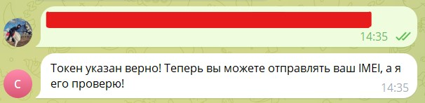

# Тестовое задание на позицию Junior Python developer

Этот проект представляет собой backend-систему для проверки IMEI устройств, интегрированная с Telegram-ботом и предоставляющая API для внешних запросов через https://api.imeicheck.net. Для взаимодействия c API сервиса использована библиотека requests, для взаимодействия с telegram - 
pyTelegramBotAPI, база данных - SQLite.

## Требования

Python 3.9

## Установка

1. Клонируйте репозиторий:

`git clone https://github.com/Leila132/Test-task-PySimpleGUI-SQLite-.git`

2. Перейдите в директорию проекта:

`cd Test-task-PySimpleGUI-SQLite-`

3. Установите зависимости:

`pip install -r requirements.txt`

4. Установите переменную окружения для ключа к API:

`export IMEI_API="YOUR_KEY"`

5. Создайте telegram бота и установите его токен в файле config.py:

`TG_TOKEN = 'YOUR_TELEGRAM_TOKEN'`

6. Создайте файл "whitelist.txt"и добавьте в него id пользователей, которые должны быть включены в белый список пользователей (по одному на каждой строчке) а затем выполните файл:

`py whitelist.py`

## Запуск

Чтобы запустить проект, выполните:

`python main.py`

## Использование

Telegram бот имеет вкладку "Меню", где отображаются доступные команды.

Боту могут писать только люди, которые находятся в белом списке (whitelist.py)
При нажатии на кнопку "help", бот рассказывает, для чего он предназначен.

С помощью команды start начинается взаимодействие, бот ожидает токен для авторизации.

Если токен введён неверно, бот будет информировать об этом и ждать верного токена.

Если токен введён верно, то авторизация пройдена и бот будет ждать от вас IMEI.

После можно ввести IMEI, и бот отправит вам полученную информацию.

## Следующие шаги

Этого не было в рамках установленного ТЗ, но я хочу оставить идеи, которые можно реализовать в этом проекте.

1. Дать возможность пользователю изменить/сбросить токен, с помощью которого он выполняет запросы. 

2.  Защита от SQL-инъекции. 

В запрос для БД вставляется установленный telegram'ом id, который менять нельзя. Но есть вероятность, что какой-то разработчик этого мессенджера поставит для себя id как некий запрос в базу данных, который сможет нарушить безопасность и изменить или уничтожить таблицы. Можно придумать способы защиты от этого.

3. User-friendly отображение ответа сервера

Ответ от сервера выводится в том виде, в каком он и поступил. Можно сделать вывод более удобным для пользователя.

4. Проверка входного imei

Вместо того, чтобы сырой запрос отправлять сразу на сервер, можно до этой стадии проверить его на наличие ошибок (присутствие иных символов, помимо цифр, проверка количества цифр).

5. Возможность обновлять/удалять пользователей из whitelist

В текущей реализации перед запуском установлен итоговый белый список без возможности удалить или добавить новых людей.